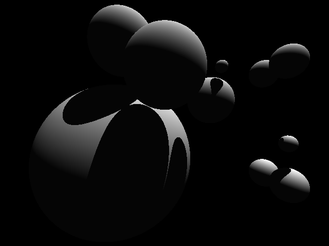

# Ejercicio Obligatorio 2

Este ejercicio corresponde al segundo ejercicio obligatorio de cátedra Algoritmos y programación 1 - 95.11 - Essaya.
El mismo consta en un segundo acercamiento a las técnicas de Raytraicing para el transporte de luz mediante el modelo de iluminación de Phong. En la imagen serán trazadas 6 esferas en un lienzo de resolución VGA con su correspondiente intensidad a partir de la colisión de rayos con las mismas.
En este caso es utilizada la componente ambiental y difusa del modelo de Phong.

## Compilando el ejercicio

``` c
gcc main.c -Wall -pedantic -std=c99 -o main -lm && ./main > imagen.pgm && convert imagen.pgm imagen.png
 ```

## Resultado

<p align="center" width="500">
   
</p>


## Documentación
[Ejercicio Obligatorio 2](https://ejercicio-obligatorio-2.netlify.app/index.html)

## Datos personales

- **Alumno:** Guido E. Rodriguez
- **Número de padrón:** 108723
- **Contacto:** guerodrigue@fi.uba.ar
- **Fecha de entrega:** 2021-10-03
- **Copyright** Copyright (c) 2021
