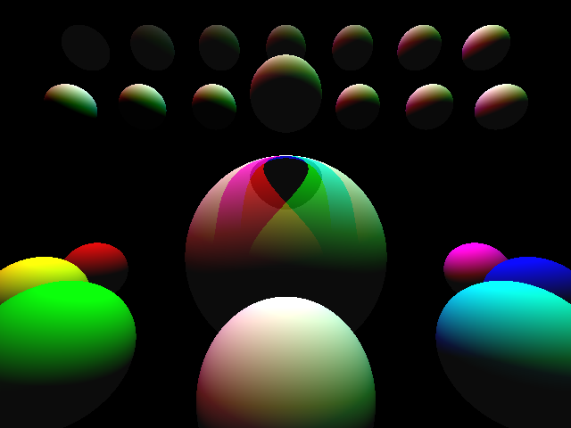

# Ejercicio Obligatorio 3

Este ejercicio corresponde al tercer ejercicio obligatorio de cátedra Algoritmos y programación 1 - 95.11 - Essaya.
El mismo consta en un tercer acercamiento a las técnicas de Raytraicing para el transporte de luz mediante el modelo de iluminación de Phong. En este caso se añade elementos al modelo tales como el color del material y la luz, coeficientes de reflexión ambiental y difusa.
En la imagen serán trazadas 23 esferas en un lienzo de resolución VGA con su correspondiente intensidad de color a partir de la colisión de rayos de luz de diferentes colores con las mismas.

## Compilando el ejercicio

``` c
gcc main.c -Wall -pedantic -std=c99 -o main -lm && ./main > imagen.ppm && convert imagen.ppm imagen.png
 ```

## Resultado

<p align="center" width="500">
   
</p>

## Documentación
[Ejercicio Obligatorio 3](https://ejercicio-obligatorio-3.netlify.app/index.html)
