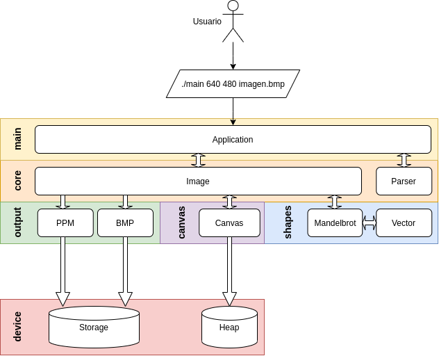

# Ejercicio Obligatorio 4

Este ejercicio corresponde al cuarto ejercicio obligatorio de cátedra Algoritmos y programación 1 - 95.11 - Essaya.
En este caso se hace hincapié en la modularización de programas, TDA (ADT), CLA y uso de la herramienta Makefile

## Diagrama de arquitectura del programa

<p align="center" width="500">
    
</p>


## Compilación y ejecución

Compilando...

```bash
make
```

Ejecutando...

**Opción PPM**

```bash
./main 640 480 imagen.ppm
```

**Opción BMP**

```bash
./main 640 480 imagen.bmp
```

## Resultado

<p align="center" width="500">
   
</p>

## Documentación
[Ejercicio Obligatorio 4](https://ejercicio-obligatorio-4.netlify.app/index.html)

## Datos personales

- **Alumno:** Guido E. Rodriguez
- **Número de padrón:** 108723
- **Contacto:** guerodrigue@fi.uba.ar
- **Fecha de entrega:** 2021-09-24
- **Copyright** Copyright (c) 2021