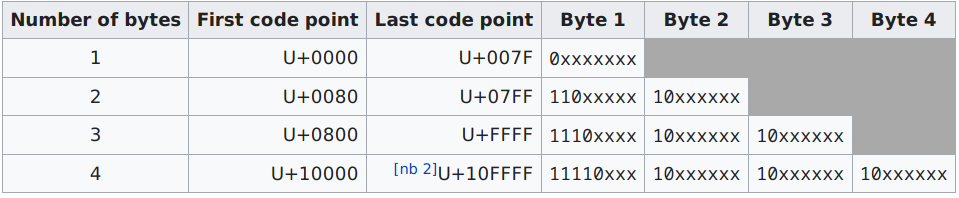
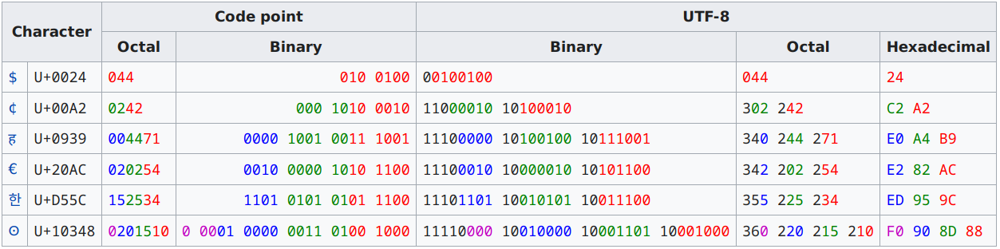

=======================
Examen final 2020-09-25
=======================

--------------------------------------------------------
95.11/75.02 - Algoritmos y Programación I - Curso Essaya
--------------------------------------------------------

Objetivo
========

Implementar código para manipular cadenas de texto Unicode.

Se dispone de los siguientes archivos:

* Archivos provistos con código:

    * ``unicode.h``: Funciones ``unicode_*`` (header)
    * ``pruebas.c``: función ``main`` + pruebas
    * ``Makefile``
* Archivos a completar con código:

    * ``unicode.c``: Funciones ``unicode_*`` (implementación)

La idea es completar el archivo ``unicode.c`` de forma tal que el programa funcione.

Al compilar con ``make``, se genera el archivo ejecutable ``unicode_pruebas``. El
mismo, al ejecutarlo, efectúa una serie de pruebas para verificar el correcto
funcionamiento de ``unicode.c``.

Las pruebas están divididas en 5 ejercicios. Es condición necesaria (pero no
suficiente) para aprobar el examen que haya 3 ejercicios OK.

Configuración de los ejercicios
===============================

Los ejercicios no están todos habilitados por defecto (para que se pueda compilar el
programa sin haber implementado todas las funciones).
Para habilitar la compilación de un ejercicio, por ejemplo el ejercicio 1,
descomentar en ``pruebas.c`` la línea que dice:

.. code:: c

    //#define EJERCICIO1_HABILITADO

es decir, que quede de la siguiente manera:

.. code:: c

    #define EJERCICIO1_HABILITADO

y volver a compilar el programa.

Salida del programa
===================

Al ejecutar el programa (``./unicode_pruebas``), se ejecutan todos los ejercicios
habilitados, y se imprime el resultado de cada uno (OK o FAIL), junto con la
cantidad de ejercicios OK. Ejemplo:

.. code::

    $ ./unicode_pruebas
    ejercicio 1: OK
    ejercicio 2: OK
    ejercicio 3: OK
    Prueba fallida en pruebas.c:122: unicode_longitud(s) == 11
    ejercicio 4: FAIL
    ejercicio 5: OK
    Cantidad de ejercicios OK: 4

Recordar: es condición necesaria (pero no suficiente) para aprobar el examen
que haya al menos 3 ejercicios OK.

Recordar: Correr el programa con ``valgrind --leak-check=full`` para mayor seguridad de que
la implementación es correcta.

Unicode
=======

El lenguaje C permite trabajar en forma nativa con cadenas de texto codificadas
en formato ASCII, que tiene muchas limitaciones, como por ejemplo que soporta
únicamente 128 combinaciones posibles para cada caracter.  Un byte es
suficiente para representar cualquier caracter de la tabla ASCII; por eso un
caracter en C se representa mediante el tipo ``char``.

El estándar más moderno **Unicode** define una tabla de caracteres con miles y
miles de combinaciones posibles (hoy en día hay 143.696 caracteres definidos, y
todos los años se agregan caracteres nuevos).

Está claro que un byte no es suficiente para cubrir todas las combinaciones
posibles en Unicode; por eso vamos a utilizar el tipo ``uint32_t`` para
representar un caracter.

El objetivo es implementar una biblioteca de funciones que permita manipular
cadenas Unicode.

Al igual que en las cadenas del lenguaje C, una cadena Unicode será
representada mediante un arreglo de caracteres (con la diferencia de que ahora
cada caracter ocupa 32 bits), y el último caracter será siempre el caracter
nulo (valor 0).

UTF-8
=====

(Nota: UTF-8 se utiliza en los ejercicios 3, 4 y 5. Podés saltear esta sección y leerla cuando vayas
a hacer alguno de esos ejercicios.)

La codificación de 32 bits por caracter no es la más eficiente en espacio para
representar una cadena Unicode.

La codificación UTF-8 aprovecha la propiedad de que la tabla Unicode tiene
muchos menos caracteres que los 4 mil millones que se podrían representar con
32 bits, y además que los caracteres con numeración baja (es decir, los
primeros caracteres de la tabla, como por ejemplo los caracteres latinos) se
suelen utilizar con más frecuencia que los que tienen numeración alta (como por
ejemplo los símbolos matemáticos). Por lo tanto, UTF-8 aplica una codificación
de **longitud variable** en la que los caracteres de numeración baja ocupan
menos bytes que los de numeración alta.

* Los caracteres que tienen numeración Unicode entre ``0x0`` y ``0x7f`` se
  codifican en UTF-8 utilizando **1 byte**.

  (Estos caracteres coinciden por diseño con la tabla ASCII, por lo que una
  cadena ASCII puede ser interpretada como una cadena UTF-8, pero no al revés.)

* Los caracteres entre ``0x80`` y ``0x7ff`` se codifican en UTF-8 usando **2 bytes**.

* Los caracteres entre ``0x800`` y ``0xffff`` se codifican en UTF-8 usando **3 bytes**.

* Los con numeración ``0x10000`` o superior se codifican en UTF-8 usando **4 bytes**.

A continuación se muestra el detalle de la codificación. (En esta tabla, la
numeración en la tabla Unicode se denomina "code point", y se escribe como
``U+xxxx`` donde ``xxxx`` es la posición en formato hexadecimal).

Ejemplos:

Descripción de los ejercicios
=============================

EJERCICIO 1
    (funciones básicas)

    Funciones a implementar:

    * ``unicode_longitud``: Devuelve la cantidad de caracteres de
      la cadena Unicode (sin contar el caracter nulo).

      Esta función es análoga a ``strlen``.

    * ``unicode_comparar``: Compara *lexicográficamente* dos cadenas
      ``s1`` y ``s2`` y devuelve un número entero ``c`` que representa el resultado de la comparación.

      * Si ``s1`` es "menor" que ``s2``, ``c`` será menor que 0.
      * Si ``s1`` y ``s2`` son iguales, ``c`` será igual a 0.
      * Si ``s1`` es "mayor" que ``s2``, ``c`` será mayor que 0.

      La comparación lexicográfica es la que se utiliza por ejemplo para ordenar las palabras
      en un diccionario (el libro, no el tipo de dato). Se trata simplemente de comparar caracter
      por caracter hasta encontrar el primer caracter diferente entre ambas cadenas. La comparación
      entre dos caracteres se hace simplemente según su valor numérico.

      Esta función es análoga a ``strcmp``.

EJERCICIO 2
    (modificación de cadenas)

    Funciones a implementar:

    * ``unicode_concatenar``: Recibe dos cadenas ``dst`` y ``src``, y modifica ``dst`` agregando
      ``src`` al final. Asumir que el arreglo ``dst`` tiene lugar suficiente para guardar la
      cadena extendida.

      Esta función es análoga a ``strcat``.

    * ``unicode_insertar``: Recibe dos cadenas ``dst`` y ``src``, y una posición ``desde``.
      Modifica ``dst`` insertando ``src`` en la posición indicada, de forma tal que el primer
      caracter de ``src`` queda en la posición ``desde``, y todo lo que estaba a partir de esa
      posición en la cadena original se corre a la derecha y queda inmediatamente luego de
      los caracteres insertados.

EJERCICIO 3
    (decodificación de UTF-8)

    Funciones a implementar:

    * ``unicode_decodificar_utf8``: Recibe un puntero a una cadena codificada en UTF-8 ``src`` y
      un puntero a una cadena Unidode ``dst``. Guarda en ``dst`` los caracteres Unicode decodificados,
      incluyendo el caracter nulo.

      Asumir que la cadena ``utf8`` no tiene errores de codificación, y que ``dst`` tiene espacio
      suficiente para guardar los caracteres.

EJERCICIO 4
    (codificación de UTF-8)

    Funciones a implementar:

    * ``unicode_codificar_utf8``: Recibe un puntero a una cadena Unicode ``src`` y un puntero a
      una cadena UTF-8 ``dst``. Guarda en ``dst`` la codificación UTF-8 de la cadena ``src``.

      Asumir que ``dst`` tiene espacio suficiente para guardar la cadena codificada.

EJERCICIO 5
    (archivos UTF-8)

    Funciones a implementar:

    * ``unicode_leer_archivo_utf8``: Recibe el nombre de un archivo que contiene texto codificado en
      UTF-8. Lee el contenido del archivo, lo decodifica (utilizando la función desarrollada en el
      ejercicio anterior) y devuelve un puntero a la cadena Unicode resultante.

      Notas:

      * Pensar bien si el archivo debe ser abierto en modo binario o de texto.
      * El archivo puede tener un tamaño arbitrario.
      * Se espera que la función devuelva un puntero a memoria dinámica, que luego será liberado con
        ``free``. Se puede usar cualquier estrategia para determinar el tamaño del bloque de memoria,
        siempre y cuando sirva para cargar archivos de tamaño arbitrario y no reserve mucha más memoria
        de lo necesario.
      * Recordar que el archivo no contiene el caracter nulo.
      * Si una cadena UTF-8 tiene ``n`` bytes (sin contar el caracter nulo), la cadena Unicode
        decodificada a lo sumo tendrá ``n`` caracteres.

    * ``unicode_escribir_archivo_utf8``: Recibe una cadena Unicode y el nombre de un archivo.
      Guarda en el archivo la cadena codificada en UTF-8 (utilizando la función desarrollada en el
      ejercicio anterior para la codificación). Devuelve un booleano indicando si la operación fue
      exitosa.

      Notas:
      * Pensar bien si el archivo debe ser abierto en modo binario o de texto.
      * Recordar que el archivo no contiene el caracter nulo.

